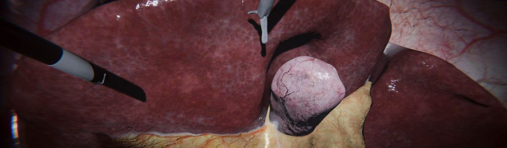
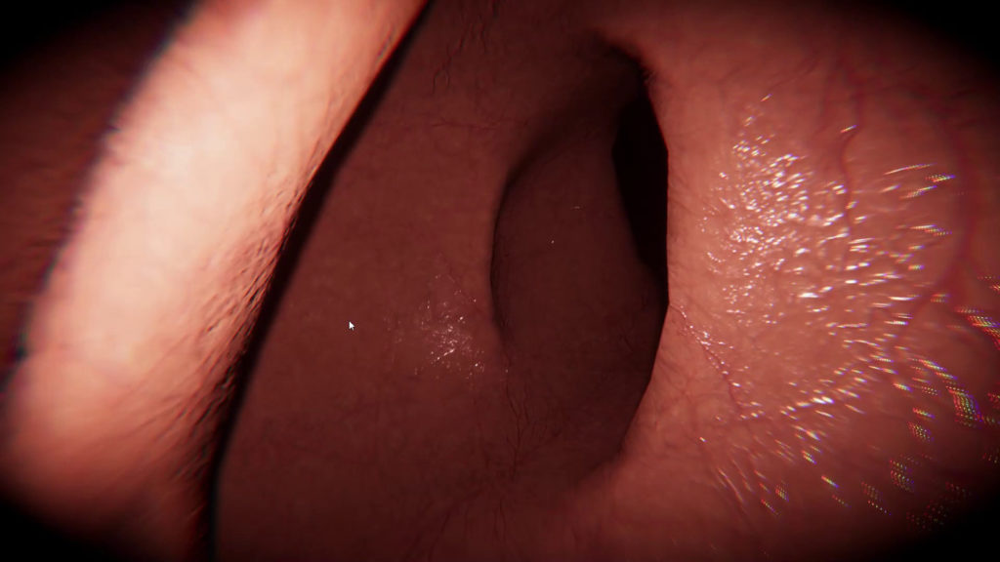

# SofaUnity Asset

## Description
With the SOFA Unity3D integration, unlock the power of real-time SOFA (Simulation Open Framework Architecture) physics simulation within Unity3D. 
This integration fully embeds SOFA as a physics engine within Unity3D, allowing you to leverage the extensive interactivity, flexibility, and performance that SOFA offers. 
With this module, you can develop Unity3D applications that include simulations of deformable objects, interactions with haptic devices, and VR or AR capabilities. 

	

## Project details
Benefit from a full integration of SOFA components with two-way communication with Unity3D. 
Leveraging an efficient C++ implementation, it becomes feasible to simulate the dynamics of soft and rigid bodies, facilitating the creation of highly realistic interactive simulations in diverse domains such as healthcare, robotics, virtual prototyping, and beyond. 
SOFA’s versatile framework enables precise modeling of complex physical phenomena, empowering developers to faithfully replicate real-world interactions and behaviors, including those with haptic devices, in VR and AR environments. 
To start building your SOFA Unity simulation yourself, make sure you have some basic knowledge of SOFA. 
To collaborate on  your own Unity projects using SOFA, reach out to InfinyTech3D for a consulting quote. 

Full description can be found [here](https://infinytech3d.com/solutions-sofaunity/)

#### Compatibility:
- Unity version > 2020.3.x (Tested with LTS: 2020.3.17 and 2021.3.19)
- SOFA version > 23.06 with SofaVerseAPI dll
- Only tested on Windows for now

## Installation guide
Full installation process available [here](https://infinytech3d.com/getting-started/).

## Examples
Here are a some results of the basic integration:
||||
|--|--|--|
| Simple Liver simulation | Carving simulation | Cutting simulation |

- **Endoscopy:** Here are other examples for endoscopy:

|||
|--|--|
| BeamAdapter SOFA plugin integration | Endoscopy Capsule navigation |

All examples are described [here](https://infinytech3d.com/basic-examples/) 

## Tutorials
Here is a set of Youtube tutorials. Whether you're just starting out or an experienced developer, our step-by-step guides offer valuable insights into leveraging SofaUnity-Renderer.

- [Tutorial 01: How to Install SofaUnity-Renderer](https://youtu.be/7ucROUFBfus?si=eIe5EfD-c241BBn2)
- [Tutorial 02: How to install from source code and use custom SOFA version](https://youtu.be/fcVxm02jN0A?si=vcd-vFmlX93BCD3r)
- [Tutorial 03: Importing a SOFA scene in your Unity project](https://youtu.be/jpLGx8j4LYg?si=PsVcKx5nNIDe7dup)

## License
This main Unity asset is under Standard Unity Asset Store EULA
Other license formats can be provided for commercial use. For more information check [InfinyTech3D license page](https://infinytech3d.com/licenses/).

